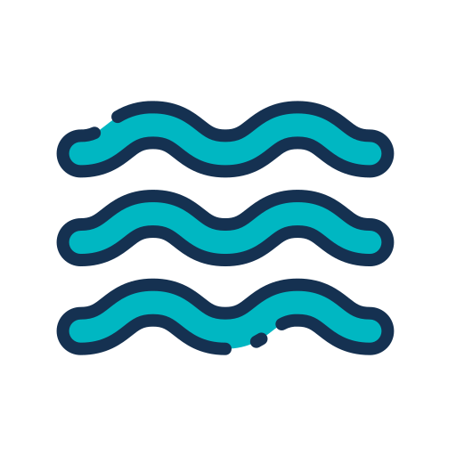

# 🌊 WaterApp

**A cross-platform Flutter application for tracking and managing water intake.**  

  

---

## 📌 About  
WaterApp is a **Flutter-based** mobile application designed to help users track their daily water intake and maintain hydration. The app provides a simple, intuitive UI with engaging visuals and reminders to encourage healthy drinking habits.

---

## 🚀 Features  
✅ **Track Water Intake** – Log your daily water consumption  
✅ **Hydration Reminders** – Get notified when it's time to drink water  
✅ **Custom Goals** – Set and customize daily water intake goals  
✅ **Statistics & Charts** – View detailed water consumption analytics  
✅ **Cross-Platform Support** – Available on Android, iOS, Web, Windows, Linux, and macOS  

---

## 📦 Installation  

### Prerequisites  
Ensure you have the following installed:  
- **Flutter SDK** (≥3.6.2) – [Install Flutter](https://docs.flutter.dev/get-started/install)  
- **Dart SDK** (≥3.7.0)  
- Android Studio or Xcode (for Android/iOS development)  

### Steps to Run the App  

1️⃣ **Clone the repository**  
```sh
git clone https://github.com/yourusername/waterapp.git
cd waterapp
```  

2️⃣ **Install dependencies**  
```sh
flutter pub get
```  

3️⃣ **Run the app**  
- **Android/iOS:**  
  ```sh
  flutter run
  ```
- **Web:**  
  ```sh
  flutter run -d chrome
  ```
- **Windows/Mac/Linux:**  
  ```sh
  flutter run -d windows | macos | linux
  ```

---

## 🔧 Configuration  

### Environment Setup  
To modify the app’s behavior, configure the following files:  

- **`pubspec.yaml`** – Manage dependencies and assets  
- **`android/app/src/main/AndroidManifest.xml`** – Modify Android-specific permissions  
- **`ios/Runner/Info.plist`** – Modify iOS-specific configurations  

### Adding Assets  
To add new images or assets, place them inside the `assets/` folder and declare them in `pubspec.yaml`:  

```yaml
flutter:
  assets:
    - assets/water.png
```

---

## 🛠 Built With  
- **Flutter** – Cross-platform UI toolkit  
- **Dart** – Programming language  
- **Material Design** – UI components  
